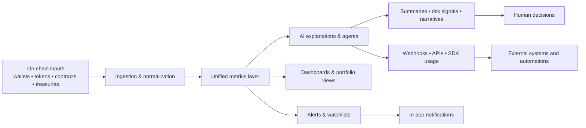
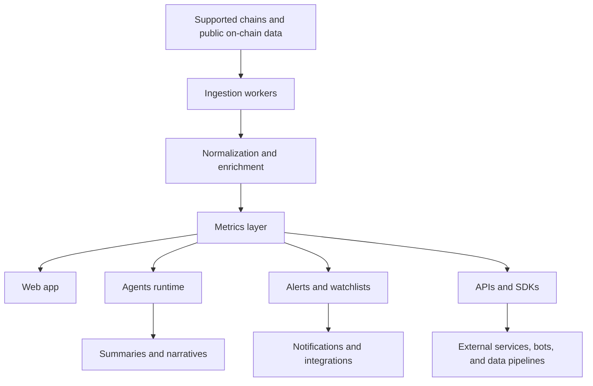

<p align="center">
  
</p>

<h1 align="center">Omnilitycs AI</h1>

<div align="center">
  <p><strong>AI-driven on-chain analytics and automation platform for traders, teams, and developers</strong></p>
  <p>
    Wallet intelligence • Token flows • Portfolio risk • Project monitoring • Agents • Alerts • APIs
  </p>
</div>

---

## System Definition

Omnilitycs AI is a crypto-native intelligence layer built on top of on-chain data

It turns wallets, tokens, portfolios, and project activity into structured metrics, AI explanations, alerts, and programmable workflows that can be used in the app, in team operations, or inside your own backend

> [!IMPORTANT]
> Omnilitycs is non-custodial by design  
> It never stores private keys and never moves funds without an explicit user signature

### What the system is built to do

| Domain | What Omnilitycs delivers |
|---|---|
| Traders | Holdings, positions, PnL, exposure, wallet behavior, token and flow context |
| Teams | Treasury monitoring, holder tracking, contract activity, project dashboards, shared alerts |
| Developers | Data APIs, Agents APIs, webhooks, SDK flows, event-driven integrations |

> [!TIP]
> The same metrics layer powers the UI, agents, alerts, and APIs  
> This keeps numbers consistent across every surface

---

## Operational Flow

Omnilitycs follows a simple end-to-end path: raw chain activity comes in, gets normalized into a shared metrics layer, is interpreted by AI agents, and then becomes outputs that humans and systems can act on



### Input → Stage → Output

| Inputs | Processing stages | Outputs |
|---|---|---|
| Wallet addresses, token activity, project contracts, treasury flows | Ingestion, normalization, aggregation, enrichment, AI interpretation | Dashboards, risk views, summaries, alerts, webhook events, API responses |
| User scopes, watchlists, thresholds, agent configs | Rule evaluation, scheduling, filtering, prioritization | Daily briefs, wallet risk summaries, token flow narratives, project event digests |

> [!NOTE]
> AI explanations are grounded in structured on-chain metrics rather than isolated text prompts  
> The model explains what the system measures instead of inventing a parallel story

---

## Core Engines

Omnilitycs is organized around a few core engines that keep the system usable for both humans and machines

### 1) Metrics Engine

This engine builds the canonical on-chain view used everywhere in the product

It computes wallet activity, holdings, positions, exposure, PnL where reconstructable, token liquidity and flows, holder concentration, and project-level movement around treasuries and contracts

### 2) Agent Engine

The agent layer reads the metrics engine and turns changes into judgments, summaries, and machine-readable outputs

| Agent type | Primary role | Typical output |
|---|---|---|
| Wallet Risk | Reviews positions, exposure, and recent behavior | Daily risk summary and top issues |
| Token Flows & Holders | Detects inflows, whale shifts, distribution changes | Change summary and flow labels |
| Portfolio Health | Evaluates concentration and portfolio-level pressure | Snapshot of portfolio risk and positions needing attention |
| Project Daily Brief | Tracks treasury, holders, and protocol activity | Team-facing daily brief with follow-ups |
| Alert Tuner | Improves noisy or late alerting setups | Suggested threshold and routing changes |

### 3) Alerting Engine

The alerting system watches thresholds, agent outputs, and event conditions, then routes important changes to the right place

It supports in-app delivery first, with messaging and webhook fan-out for more advanced workflows

### 4) Integration Engine

This is the programmable surface for developers and operators

It exposes portfolio data, token and wallet views, agent runs, webhook delivery, and usage state so Omnilitycs can plug into bots, backends, and internal pipelines

---

## Control Surface

Omnilitycs is designed to be controllable rather than opaque

You can choose what is monitored, how the system interprets it, how loud it should be, and where outputs should go

### Main control areas

| Control area | What you configure |
|---|---|
| Scope | Wallets, token lists, project addresses, treasuries, workspaces |
| Filters | Minimum size, time windows, chain selection, allowlists and ignore rules |
| Agent logic | Risk-focused, flow-focused, narrative-focused, daily summary modes |
| Outputs | UI summaries, JSON payloads, risk bullets, labels, webhook events |
| Delivery | In-app, email, Telegram, Discord, webhook endpoints |
| Permissions | Viewer, editor, admin, key scopes, workspace boundaries |

> [!WARNING]
> Agents can observe, summarize, alert, and push structured outputs  
> They do not custody funds, sign transactions, or auto-trade on your behalf

### Typical control model

```text
scope → filters → agent profile → thresholds → output mode → delivery route
```

This makes the system understandable for traders, auditable for teams, and scriptable for developers

---

## Usage Tiers

### Basic

The basic layer is for quick onboarding and everyday manual usage

| Mode | Best for | Includes |
|---|---|---|
| Local / quick start | Solo traders and first-time teams | Wallet connection, portfolio view, token and wallet insights, basic alerts, default agents |

### Advanced

The advanced layer is for users who want more tailored workflows

| Mode | Best for | Includes |
|---|---|---|
| Customization | Power users, desks, research teams | Custom watchlists, tuned thresholds, custom agents, richer routing, broader scopes |

### Production

The production layer is where Omnilitycs becomes part of operating infrastructure

| Mode | Best for | Includes |
|---|---|---|
| Scaling and reliability | Protocol teams, backend systems, serious operators | Workspace roles, APIs, webhooks, observability, CI/CD handling, usage governance |

> [!CAUTION]
> Heavy usage should be planned around credits, alert volume, webhook handling, and API rate limits  
> Production setups need clear ownership of keys, routing, and incident response

---

## Architecture Notes

Omnilitycs is a layered system rather than a single interface

### High-level topology



### Main components

| Layer | Responsibility |
|---|---|
| Ingestion | Reads supported chain activity and wallet or contract data |
| Processing | Normalizes raw events and aggregates them into usable metrics |
| Intelligence | Generates AI summaries, narratives, and agent outputs |
| Delivery | Powers UI views, alerts, exports, APIs, and webhooks |
| Governance | Handles workspaces, permissions, keys, credits, and plan logic |

### Stack expectations

The system is documented as a web-first platform with messaging integrations, HTTP APIs, SDK access, webhook delivery, workspace controls, and production-friendly operational boundaries

That means the architecture should be read as platform infrastructure, not as a thin dashboard on top of RPC calls

---

## Reality Check

Omnilitycs is built to reduce noise and improve reaction speed, but it is not a magic profit engine

### What to expect realistically

| Area | Realistic expectation |
|---|---|
| Analytics | Stronger visibility into wallets, tokens, positions, and project-level movement |
| AI summaries | Faster interpretation of changes, not infallible truth |
| Alerts | Better timing and awareness, but still dependent on thresholds and routing quality |
| Agents | Repeatable monitoring and structured outputs, not autonomous financial decisions |
| Integrations | Useful for pipelines and automations, but still require your own safeguards |

> [!NOTE]
> AI outputs can be incomplete, delayed, or wrong in edge cases  
> Important decisions should always be verified against the underlying data

### Known caveats

- PnL reconstruction can depend on available data quality and position complexity
- Wallet labeling and behavioral interpretation may be partial
- Alert quality is heavily influenced by thresholds and scope design
- High-noise universes need careful filtering before they become operationally useful

---

## Run / Deploy

### Local or internal usage

Use Omnilitycs as a product layer when the goal is fast insight, manual monitoring, or team visibility

Typical flow:
1. Connect wallets or add project addresses
2. Build a first dashboard
3. Enable default agents
4. Add critical alerts
5. Review summaries and refine thresholds

### Developer integration

Use the platform API surface when Omnilitycs needs to become part of your own systems

| Deploy path | Practical use |
|---|---|
| API key + SDK | Portfolio pulls, token and wallet summaries, agent execution |
| Webhooks | Push events into bots, automations, and internal services |
| Workspace setup | Team access, roles, alert routing, shared views |
| Production controls | Key rotation, monitoring, credit oversight, staged rollout of agent configs |

### Deployment mindset

For serious environments, treat agent definitions, rules, and webhook routing as versioned infrastructure

Keep configurations reviewed, staged, observable, and easy to roll back

> [!IMPORTANT]
> Omnilitycs should sit inside a controlled production setup  
> Real actions, key management, and execution logic should remain on your own infrastructure

---

## System Snapshot

| Property | Omnilitycs AI |
|---|---|
| Product type | On-chain analytics and automation platform |
| Core abstraction | Unified on-chain metrics layer |
| Main intelligence unit | Agents |
| Primary outputs | Dashboards, summaries, alerts, APIs, webhooks |
| Security posture | Non-custodial, role-scoped, key-based, webhook-signed |
| Economic layer | Plans, credits, and $OMNI-based usage mechanics |

---

## Final Read

Omnilitycs AI is best understood as an operating layer for on-chain intelligence

It helps traders read their exposure, helps teams monitor project reality, and helps developers turn on-chain context into systems and workflows without rebuilding the same analytics foundation from scratch
